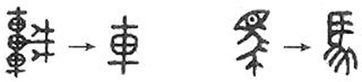

# GAOKAO-MM

GAOKAO-MM是一个以中国高考题目为数据集的多模态评测基准，测评多模态模型的感知、理解、知识、推理等综合能力。

[[Read In English]](./README_EN.md)[[Paper]](https://arxiv.org/abs/2402.15745)

## 介绍

随着多模态大模型的迅速发展，如何评测其综合能力成为亟待解决的问题。我们提出一个新的依托中国高考题目的多模态数据集GAOKAO-MM，用于评测多模态模型的人类水平能力，包括感知、理解、知识、推理等。GAOKAO-MM覆盖了2010年至2023年中国高考全国卷所有的带图选择题，包括8个科目和12种图像类型。我们在10个多模态大模型上进行了实验，所有的模型正确率都低于50%。同时，它们在不同科目、不同图像类型的表现大相径庭，这说明多模态模型距离通用人工智能（Artificial General Intelligence, AGI）依然有巨大的提升空间。

## 数据集

GAOKAO-MM包括语文、数学、物理、化学、生物、政治、历史、地理8个科目以及示意图、折线图、地图、照片、几何图形等12种图像类型。GAOKAO-MM包含了646道选择题和897张图片，具体的题目示例如下：

- **Question**

> 1. 如图是西周与战国两个时期相同文字的不同写法, 反映出字形发生了变化, 促成这一变化的主要因素是 ( )
>
>    A. 文字的频繁使用	
>
>    B. 书写材料的不同	
>
>    C. 各国变法的实施	
>
>    D. “书同文”的推行
>
> 
>
> The picture shows the different writing methods of the same characters in the Western Zhou Dynasty and the Warring States Period, reflecting changes in the shape of the characters. The main factors that contributed to this change are ( )
>
> A. Frequent use of writing	 						
>
> B. Differences in writing materials 	
>
> C. Implementation of reforms in various countries 		  
>
> D. Promotion of "shu tongwen"
>
> 

* **Image**



* **Answer**

> A

* **Explanation**

> 【解答】
>
> A. 中国古代汉字发展的总体趋势是由繁到简, 之所以出现这样的变化是由于中国的现实, 西周到战国时期社会政治经济市场化不断的发展, 文字在社会发展中的表述功能越来越强, 被频繁地使用, 所以必须由繁到简便于书写。
>
> B. 从西周到战国时期, 我国出现了简读, 都是写在竹和木片上, 而且都用笔和墨。
>
> C. 各国变法从春秋时期开始，但是各国变法中并没有涉及到文字的。
>
> D. 书同文是秦始皇推行的措施, 和材料时代不符。
>
> 故选: A。
>
> 【Analysis】
>
> A. The overall trend of the development of ancient Chinese characters is from complexity to simplicity. The reason for such changes is due to the continuous development of society, politics, economy, and marketization from the Western Zhou Dynasty to the Warring States Period in China. As writing became increasingly important in social development, it was used frequently, hence the need for simplification for ease of writing. 
>
> B. From the Western Zhou Dynasty to the Warring States Period, simplification emerged in China, with writing done on bamboo and wooden slips, using pens and ink. 
>
> C. Reforms in various countries began in the Spring and Autumn Period, but they did not involve changes to writing systems. 
>
> D. "Shu tongwen" was a measure implemented by Emperor Qin Shi Huang, which is not consistent with the materials used during that period.
>
> The answer is A.

## 实验结果

我们在10个多模态大模型上进行了实验，采用了zero-shot方式和基于规则的答案抽取方法。我们本地部署了开源模型，并通过API调用闭源模型。实验结果表明GAOKAO-MM对目前的多模态模型难度较大，所有模型的正确率都低于50%。


| **Models**            | **Overall** | **Chinese** | **Math.** | **Phys.** | **Chem.** | **Biol.** | **Poli.** | **Hist.** | **Geog.** |
| --------------------- | ----------- | ----------- | --------- | --------- | --------- | --------- | --------- | --------- | --------- |
| **VisCPM-Chat**       | 16.8%       | 0.0%        | 18.8%     | 3.7%      | 22.4%     | 23.8%     | 3.0%      | 32.4%     | 24.9%     |
| **VisualGLM-6B**      | 20.7%       | **21.9%**   | 16.3%     | 12.1%     | 25.4%     | 28.6%     | 21.2%     | 38.2%     | 24.0%     |
| **CogVLM-Chat**       | 13.2%       | 3.1%        | 17.5%     | 0.0%      | 16.4%     | 9.5%      | 12.1%     | 20.6%     | 21.3%     |
| **LLaVA-1.5-7B**      | 17.9%       | 6.2%        | 12.5%     | 7.2%      | 23.9%     | 14.3%     | 21.2%     | 32.4%     | 24.9%     |
| **LLaVA-1.5-13B**     | 18.0%       | 3.1%        | 16.3%     | 10.6%     | 19.4%     | 33.3%     | 12.1%     | 23.5%     | 23.5%     |
| **mPLUG-Owl2**        | 24.1%       | 6.2%        | 22.5%     | 12.4%     | 22.4%     | 28.6%     | 48.5%     | 32.4%     | 30.3%     |
| **Qwen-VL-Chat**      | 14.2%       | 0.0%        | 17.5%     | 3.2%      | 16.4%     | 14.3%     | 15.2%     | 26.5%     | 19.9%     |
| **InternLM-XComposer2-VL-7B**| 33.2%| 3.1%        | 20.0%     | 19.5%     | 29.9%     | 42.9%     | 33.3%     | 47.1%     | 48.9%     |
| **GPT-4V**            | **48.1%**   | 18.8%       | **45.0%** | **26.7%** | 41.8%     | 38.1%     | **75.8%** | 79.4%     | **62.0%** |
| **Qwen-VL-Plus**      | 41.2%       | 18.8%       | 33.8%     | 14.4%     | **44.8%** | **42.9%** | 63.6%     | **82.4%** | 55.7%     |
| **Gemini-Pro-Vision** | 35.1%       | 18.8%       | 23.7%     | 17.2%     | 38.8%     | **42.9%** | 54.5%     | 55.9%     | 46.6%     |

## 简单示例

#### Openai API

1. 生成答案

你可以直接使用如下的指令调用GPT-4V进行评测，生成结果保存在`./Results/gpt-4-vision-preview`中：

```
cd ./Bench
python choice_bench.py --openai_api_key="your openai api key"
```

2. 计算模型正确率

你可以直接使用如下指令计算GPT-4V生成答案的正确率，结果保存在`./Results/gpt-4-vision-preview/correction_score.json`中：

```
python OBJ_score_evaluation.py --obj_output_dir=../Results/gpt-4-vision-preview
```

#### 其他模型

你可以将其他模型封装为API并存放在`./Models`中，封装方式可参考`./Models/openai_gpt4.py`。

## 引用

```
@misc{zong2024gaokaomm,
      title={GAOKAO-MM: A Chinese Human-Level Benchmark for Multimodal Models Evaluation}, 
      author={Yi Zong and Xipeng Qiu},
      year={2024},
      eprint={2402.15745},
      archivePrefix={arXiv},
      primaryClass={cs.CL}
}
```

 
