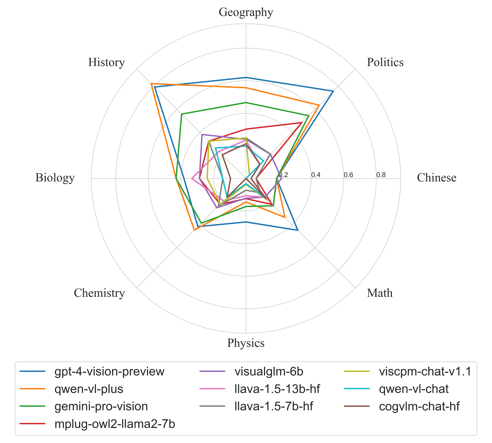

# GAOKAO-MM

GAOKAO-MM is a multimodal benchmark based on Chinese College Entrance Examination (GAOKAO), evaluating the abilities of large vision-language models (LVLMs) including perception, understanding, knowledge and reasoning. 

[[Read In Chinese]](./README.md)[[Paper]]()

## Introduction

With the rapid development of LVLMs, how to assess their comprehensive performance becomes an urgent issue to be addressed. We propose a new multimodal benchmark GAOKAO-MM which derives from questions in GAOKAO and evaluates the human-level abilities including perception, understanding, knowledge and reasoning. GAOKAO-MM covers the questions with images in GAOKAO from 2010 to 2023 and comprises 8 subjects and 12 image types. We conduct experiments on 10 multimodal large models, and all models demonstrated accuracy rates below 50%. Simultaneously, their performance varied significantly across different subjects and types of images, indicating that multimodal models still have considerable room for improvement before achieving Artificial General Intelligence (AGI).

## Dataset

GAOKAO-MM comprises 8 subjects: Chinese, Mathematics, Physics, Chemistry, Biology, Politics, History, and Geography, as well as 12 types of images including diagrams, line graphs, maps, photographs, and geometric shapes. GAOKAO-MM contains 646 multiple-choice questions and 897 images, with specific examples of the questions as follows:

- **Question**

> 1. 如图是西周与战国两个时期相同文字的不同写法, 反映出字形发生了变化, 促成这一变化的主要因素是 ( )
>
>    A. 文字的频繁使用	
>
>    B. 书写材料的不同	
>
>    C. 各国变法的实施	
>
>    D. “书同文”的推行
>
> 
>
> The picture shows the different writing methods of the same characters in the Western Zhou Dynasty and the Warring States Period, reflecting changes in the shape of the characters. The main factors that contributed to this change are ( )
>
> A. Frequent use of writing	 						
>
> B. Differences in writing materials 	
>
> C. Implementation of reforms in various countries 		  
>
> D. Promotion of "shu tongwen"
>
> 

* **Image**


* **Answer **

> A

* **Explanation**

> 【解答】
>
> A. 中国古代汉字发展的总体趋势是由繁到简, 之所以出现这样的变化是由于中国的现实, 西周到战国时期社会政治经济市场化不断的发展, 文字在社会发展中的表述功能越来越强, 被频繁地使用, 所以必须由繁到简便于书写。
>
> B. 从西周到战国时期, 我国出现了简读, 都是写在竹和木片上, 而且都用笔和墨。
>
> C. 各国变法从春秋时期开始，但是各国变法中并没有涉及到文字的。
>
> D. 书同文是秦始皇推行的措施, 和材料时代不符。
>
> 故选: A。
>
> 【Analysis】
>
> A. The overall trend of the development of ancient Chinese characters is from complexity to simplicity. The reason for such changes is due to the continuous development of society, politics, economy, and marketization from the Western Zhou Dynasty to the Warring States Period in China. As writing became increasingly important in social development, it was used frequently, hence the need for simplification for ease of writing. 
>
> B. From the Western Zhou Dynasty to the Warring States Period, simplification emerged in China, with writing done on bamboo and wooden slips, using pens and ink. 
>
> C. Reforms in various countries began in the Spring and Autumn Period, but they did not involve changes to writing systems. 
>
> D. "Shu tongwen" was a measure implemented by Emperor Qin Shi Huang, which is not consistent with the materials used during that period.
>
> The answer is A.

## Results

We conduct experiments on 10 multimodal large models using zero-shot settings and a rule-based answer extraction method. We deploy open-source models locally and access closed-source models through API calls. The results indicate that GAOKAO-MM presents a significant challenge to the current multimodal models, with all models achieving accuracy rates below 50%.




| **Models**            | **Overall** | **Chinese** | **Math.** | **Phys.** | **Chem.** | **Biol.** | **Poli.** | **Hist.** | **Geog.** |
| --------------------- | ----------- | ----------- | --------- | --------- | --------- | --------- | --------- | --------- | --------- |
| **VisCPM-Chat**       | 16.8%       | 0.0%        | 18.8%     | 3.7%      | 22.4%     | 23.8%     | 3.0%      | 32.4%     | 24.9%     |
| **VisualGLM-6B**      | 20.7%       | **21.9%**   | 16.3%     | 12.1%     | 25.4%     | 28.6%     | 21.2%     | 38.2%     | 24.0%     |
| **CogVLM-Chat**       | 13.2%       | 3.1%        | 17.5%     | 0.0%      | 16.4%     | 9.5%      | 12.1%     | 20.6%     | 21.3%     |
| **LLaVA-1.5-7B**      | 17.9%       | 6.2%        | 12.5%     | 7.2%      | 23.9%     | 14.3%     | 21.2%     | 32.4%     | 24.9%     |
| **LLaVA-1.5-13B**     | 18.0%       | 3.1%        | 16.3%     | 10.6%     | 19.4%     | 33.3%     | 12.1%     | 23.5%     | 23.5%     |
| **mPLUG-Owl2**        | 24.1%       | 6.2%        | 22.5%     | 12.4%     | 22.4%     | 28.6%     | 48.5%     | 32.4%     | 30.3%     |
| **Qwen-VL-Chat**      | 14.2%       | 0.0%        | 17.5%     | 3.2%      | 16.4%     | 14.3%     | 15.2%     | 26.5%     | 19.9%     |
| **GPT-4V**            | **48.1%**   | 18.8%       | **45.0%** | **26.7%** | 41.8%     | 38.1%     | **75.8%** | 79.4%     | **62.0%** |
| **Qwen-VL-Plus**      | 41.2%       | 18.8%       | 33.8%     | 14.4%     | **44.8%** | **42.9%** | 63.6%     | **82.4%** | 55.7%     |
| **Gemini-Pro-Vision** | 35.1%       | 18.8%       | 23.7%     | 17.2%     | 38.8%     | **42.9%** | 54.5%     | 55.9%     | 46.6%     |

## Evaluation Method

#### Openai API

1. Generate Answers

You can directly use the following command to invoke GPT-4V for evaluation, and the generated results will be saved in `./Results/gpt-4-vision-preview`:

```
cd ./Bench
python choice_bench.py --openai_api_key="your openai api key"
```

2. Calculate the Accuracy Rate

You can directly use the following command to calculate the accuracy rate of the answers generated by GPT-4V, with the results saved in `./Results/gpt-4-vision-preview/correction_score.json`:

```
python OBJ_score_evaluation.py --obj_output_dir=../Results/gpt-4-vision-preview
```

#### Other Models

You can encapsulate other models as APIs and store them in `./Models`, with the encapsulation method referable to `./Models/openai_gpt4.py`.

## Citation

